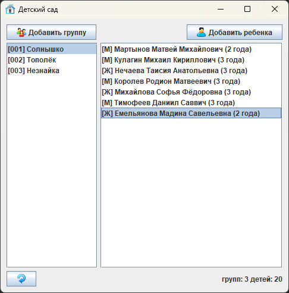

## №12. Детский сад

#### Задание:
Вести учет детей в детском саду.
Ребенок: ФИО, пол, возраст.
Группа: название, номер.

- добавлять/удалять группу и детей в них
- редактировать группы/детей

Выводить информацию по группам (группа, дети в ней.)

#### Реализация:

